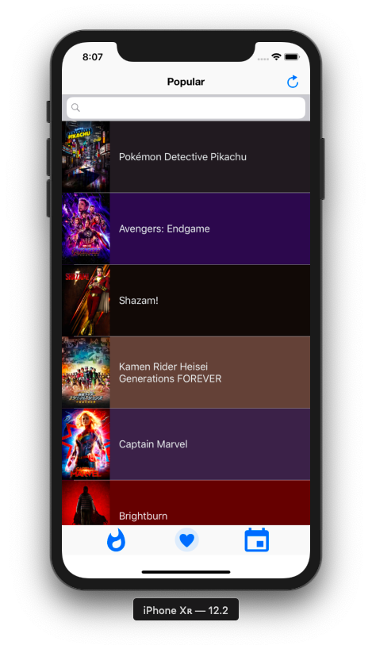
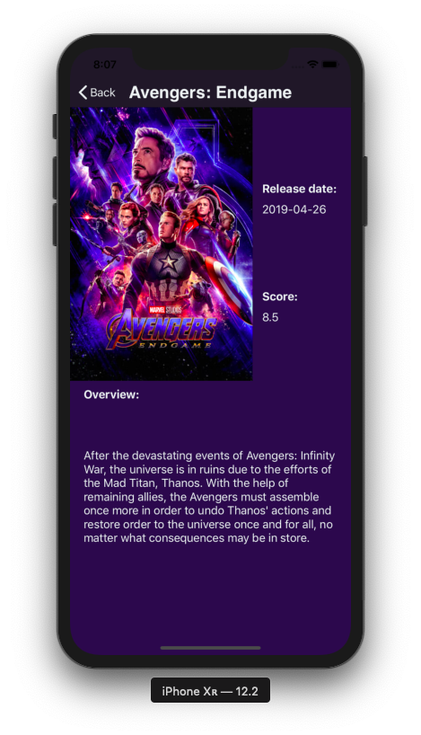

# Movies!

App that retrieves movies lists using an API from "www.themoviedb.org".

 

- Note: The pods must be installed and a API key from the site is required so the app can work.

-----
The MovieListViewController class manages the first view. It is responsable for: retrieving the movie list; presenting the movies in the TableView according to their category; and for searching for a movie title using the search bar. The movie data is fetched using Alamofire networking and parsed using SwiftyJSON. The parsed data is persisted using Realm.
The first view uses 3 buttons in the bottom Toolbar in order to switch between categories (Popular, Top Rated, Upcoming). The refresh button in the top right corner updates the movie list, as long as there is an internet connection.

The TableView uses a custom cell from the CustomMovieCell class, so it can show the movie poster in the cell.

The DetailsViewController class manages the second view. It is responsable for populating the UI elements with the selected movie details.

The views are embedded in a navigation controller and use ChameleonFramework to color the TableView cells and the movie details.

The Movie class is responsable for setting the properties of a single movie. A Movie object is created for each movie and its properties are filled from the JSON data.

-----
For me, a clean code is that that has packages of several specific functionalities so it doesn't have repeated code.
